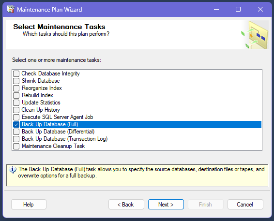
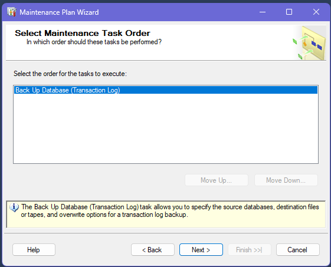
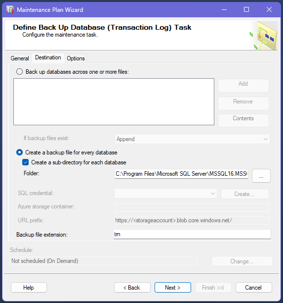
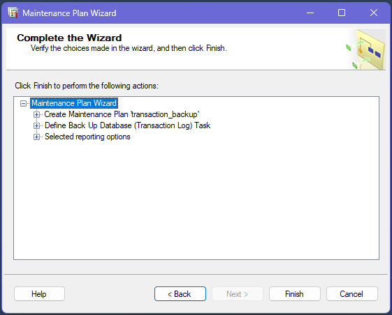

# Projekt Bazy Danych

---

**Temat:** Poszukiwacz skarbów

**Autor:** Wiktor Piotrowski

---

## 1.  Wymagania funkcjonalne i niefunkcjonalne

### Wymagania funkcjonalne

#### 1. Klienci

- Dane podstawowe:
    - Przechowywanie danych osobowych i teleadresowych (imię, nazwisko, adres, numer telefonu, e-mail).
- Pola rozszerzone:
    - Możliwość dodawania niestandardowych informacji – struktura tabeli powinna umożliwiać rozszerzenie o dodatkowe kolumny (np. notatki, preferencje) lub wykorzystywać pola typu JSON do przechowywania dynamicznych danych.
- Lokalizacja:
    - Pola do przechowywania danych geograficznych, np. współrzędnych (latitude, longitude) lub szczegółowego adresu, co pozwoli na analizy zasięgu firmy i planowanie tras.

#### 2. Kontakty

- Dane kontaktowe:
    - Przechowywanie podstawowych danych osób kontaktowych (imię, nazwisko, dane teleadresowe).
- Hierarchia kontaktów:
    - Rejestracja powiązań – konieczność uwzględnienia informacji, przez kogo (inny kontakt lub klient) został pozyskany dany kontakt.
    - Wykorzystanie relacji samoodwołujących się (self-referential foreign key) umożliwiających zbudowanie drzewa lub sieci kontaktów.

#### 3. Zlecenia

- Podstawowe informacje:
    - Identyfikator zlecenia, opis poszukiwanego przedmiotu, daty (rozpoczęcia, zakończenia, terminu wykonania) oraz status zlecenia.
- Powiązania:
    - Klucz obcy łączący zlecenie z klientem.
    - Mechanizm umożliwiający przypisanie jednego lub wielu kontaktów do konkretnego zlecenia – może być to tabela łącząca w relacji wiele-do-wielu.

#### 4. Notatki

- Przechowywanie treści:
    - Pole tekstowe umożliwiające zapisanie dowolnej informacji dotyczącej klienta, kontaktu czy zlecenia.
- Wyszukiwanie pełnotekstowe:
    - Implementacja indeksów pełnotekstowych dla szybkiego przeszukiwania notatek pod kątem określonych słów lub fraz.
- Powiązania:
    - Klucz obcy wskazujący, do którego rekordu (klient, kontakt, zlecenie) odnosi się dana notatka.

#### 5. Koszty

- Ewidencja wydatków:
    - Przechowywanie informacji o kosztach powiązanych z danym zleceniem, klientem lub kontaktem.
- Kategoryzacja:
    - Pole określające rodzaj kosztu (np. przelot, hotel, zakup sprzętu, wydatki nietypowe).
- Szczegóły finansowe:
    - Kwota, data wydatku oraz ewentualnie dodatkowe uwagi lub metadane dotyczące rozliczeń.

#### 6. Użytkownicy bazy

- Rejestr użytkowników:
    - Dane logowania (np. nazwa użytkownika, hasło – przechowywane zgodnie z zasadami bezpieczeństwa) oraz ewentualne dane kontaktowe.
- Uprawnienia:
    - Definiowanie ról (np. administrator z pełnymi uprawnieniami oraz poszukiwacz – ograniczony dostęp tylko do odczytu) poprzez mechanizmy kontroli dostępu na poziomie bazy (widoki, procedury lub mechanizmy samej bazy).

#### 7. Relacje i spójność danych

- Klucze główne i obce:
    - Każda tabela musi posiadać odpowiednie klucze główne, a relacje między tabelami (np. klient – zlecenie, zlecenie – notatka) realizowane są za pomocą kluczy obcych.
- Relacje wiele-do-wielu:
    - Stworzenie tabel pośredniczących dla relacji, gdzie jeden rekord może być powiązany z wieloma rekordami innej tabeli (np. zlecenia i kontakty).

### Wymagania niefunkcjonalne

#### 1. Wydajność zapytań

- Indeksowanie:
    - Wprowadzenie indeksów na najczęściej przeszukiwanych polach (np. nazwiska, lokalizacje, klucze obce) oraz pełnotekstowe indeksy dla notatek.
- Optymalizacja zapytań:
    - Przeprowadzenie analizy planów zapytań i optymalizacja struktury bazy, aby zapewnić szybki dostęp do danych nawet przy dużej liczbie rekordów.

#### 2. Integralność danych

- Constraints:
    - Ustalenie ograniczeń na poziomie bazy (NOT NULL, UNIQUE, CHECK) w celu utrzymania poprawności i spójności danych.
- Transakcje:
    - Obsługa transakcji gwarantujących atomowość operacji (szczególnie przy zapisie powiązanych rekordów w kilku tabelach).

#### 3. Bezpieczeństwo

- Kontrola dostępu:
    - Definiowanie uprawnień na poziomie tabel, kolumn i widoków, aby zapewnić odpowiednią separację ról (administracja vs. odczyt).
- Szyfrowanie:
    - Szyfrowanie wrażliwych danych oraz zabezpieczenia związane z przechowywaniem haseł.

#### 4. Skalowalność

- Projektowanie schematu:
    - Umożliwienie rozszerzenia schematu bazy danych o nowe pola lub tabele bez konieczności gruntownej przebudowy.
- Partycyjność:
    - Możliwość partycjonowania dużych tabel w celu poprawy wydajności przy rosnącej liczbie rekordów.

#### 5. Dostępność i niezawodność

**Kopie zapasowe i odzyskiwanie:**

- Harmonogram backupów:

    - Full Backup (pełna kopia):

        - Wykonywany raz dziennie o 2:00 AM.

        - Przechowywany przez 7 dni (automatyczne usuwanie po upływie okresu).

    - Differential Backup (kopia przyrostowa):

        - Wykonywany co 4 godziny w przedziale 12:00 AM – 8:00 PM (6 kopii dziennie).

        - Przechowywany przez 24 godziny (automatyczne usuwanie po upływie doby).

    - Transaction Log Backup (kopia logów transakcyjnych):

        - Wykonywany co 15 minut w godzinach 8:00 AM – 6:00 PM.

        - W godzinach 6:00 PM – 8:00 AM wykonywany co 1 godzinę.

        - Przechowywany przez 48 godzin (automatyczne usuwanie po 2 dniach).

- Procedury odzyskiwania:

    - Gwarantowany RTO (Recovery Time Objective): Maksymalnie 1 godzina dla pełnego przywrócenia systemu.

    - Schemat odzyskiwania: pełna kopia → ostatnia kopia przyrostowa → wszystkie logi transakcyjne od ostatniej kopii przyrostowej.

    - Cotygodniowe testy odzyskiwania w środowisku izolowanym.

- Monitorowanie integralności:

    - Automatyczne wykonanie CHECKDB (sprawdzenie spójności bazy) raz dziennie o 1:00 AM.

    - Alerty w przypadku wykrycia błędów (np. uszkodzenie stron danych).

**Wskaźniki SLA**

| Metryka            | Cel                        |
|--------------------|----------------------------|
| Dostępność systemu | 99.9% (8.76h przestoju/rok)|
| RTO                | ≤ 1 godzina	              |
| RPO                | ≤ 15 minut (dziennie)      |


#### 6. Elastyczność w przechowywaniu danych niestandardowych

- Typy danych:
    - Wykorzystanie typów danych umożliwiających przechowywanie dynamicznych lub niestandardowych informacji (np. JSON) tam, gdzie wymagane są elastyczne struktury danych.

## 2. Projekt bazy danych

### Schemat bazy danych


## 3. Implementacja

 1. Wykonujemy **treausre_hunter_db.sql**
 2. Wykonujemy **management (treasure_hunter_db).sql**
 3. Następnie tworzymy **Maintenance Plans** (Wybieramy nasz server -> Managment -> Maintenance Plans -> (klikamy prawym) Maintenance Plan Wizard
 (załączam również skrypty wykonania Jobs w Sql Server Agent, ponieważ od SSMS nowszego niż 18 nie da się eksportować paczek Maintenance Plans pokazuje poniżej jak je zrobić)
    
    - robimy tak jak na zdjęciach:

        

        

        

        - wybieramy baze treasure_hunter_db 
        
        
        
        

        

        

        

        - w SQL Server Agent -> Jobs -> klikamy na "full_backup.Subplan_1" -> wybieramy stronę "Schedules" i klikamy nowy

        
    
    - Analogicznie pozostałe rzeczy

        

        

        

        

        

        

        

        

        

        

        

        

        

        

        

        

        

        

        

        

        
        
        

        

        

        

        

## 4. Przykładowe zapytania i procedury składowane

1. Zapytania wykorzystujące dane JSON

    - Pobieranie preferencji kontaktowych z kolumny JSON:

    ```sql
        SELECT 
            ClientID,
            FirstName,
            LastName,
            JSON_VALUE(AdditionalInfo, '$.preferred_contact') AS PreferredContact
        FROM Clients
        WHERE JSON_VALUE(AdditionalInfo, '$.preferred_contact') IS NOT NULL;
    ```
    - Wyszukiwanie zamówień z wysokim priorytetem:

    ```sql
        SELECT 
            OrderID,
            Description,
            JSON_VALUE(AdditionalInfo, '$.priority') AS Priority
        FROM Orders
        WHERE JSON_VALUE(AdditionalInfo, '$.priority') = 'high';
    ```

    - Aktualizacja informacji dodatkowych w formacie JSON:

    ```sql
        UPDATE Clients
        SET AdditionalInfo = JSON_MODIFY(
            AdditionalInfo,
            '$.special_requirements',
            'urgent'
        )
        WHERE ClientID = 3;
    ```

2. Zapytania wykorzystujące dane przestrzenne (GEOGRAPHY)

    - Wyszukiwanie klientów w promieniu 100 km od Warszawy:
    
    ```sql
        DECLARE @warsaw GEOGRAPHY = GEOGRAPHY::Point(52.2297, 21.0122, 4326);

        SELECT 
            ClientID,
            FirstName,
            LastName,
            Location.STDistance(@warsaw)/1000 AS DistanceInKm
        FROM Clients
        WHERE Location.STDistance(@warsaw) <= 100000; -- 100 km w metrach
    ```

    - Znajdź najbliższego klienta dla danego punktu:

    ```sql
        DECLARE @point GEOGRAPHY = GEOGRAPHY::Point(51.5074, -0.1278, 4326);

        SELECT TOP 1 *
        FROM Clients
        ORDER BY Location.STDistance(@point);
    ```

3. Wykorzystanie wyszukiwania pełnotekstowego

    - Wyszukiwanie fraz w notatkach:

    ```sql
        SELECT 
            NoteID,
            NoteText
        FROM Notes
        WHERE CONTAINS(NoteText, 'confirmed');
    ```

    - Wyszukiwanie "shipwreck" w istniejących indeksach pełnotekstowych:

    ```sql
        SELECT 
            n.NoteID,
            n.NoteText,
            o.Description AS RelatedOrderDescription
        FROM Notes n
        LEFT JOIN Orders o ON n.OrderID = o.OrderID
        WHERE CONTAINS(n.NoteText, 'shipwreck');
    ```

4. Przykładowe procedury składowane

    - Procedura dodająca klienta z danymi przestrzennymi i JSON:

    ```sql
        CREATE PROCEDURE AddClientWithLocation
            @FirstName NVARCHAR(50),
            @LastName NVARCHAR(50),
            @Lat FLOAT,
            @Lon FLOAT,
            @AdditionalInfo NVARCHAR(MAX)
        AS
        BEGIN
            INSERT INTO Clients (
                FirstName,
                LastName,
                Location,
                AdditionalInfo
            ) VALUES (
                @FirstName,
                @LastName,
                GEOGRAPHY::Point(@Lat, @Lon, 4326),
                @AdditionalInfo
            );
        END;
    ```

    - Procedura wyszukująca klientów według kryteriów JSON i lokalizacji:

    ```sql
        CREATE PROCEDURE SearchClients
            @SearchTerm NVARCHAR(100),
            @Lat FLOAT,
            @Lon FLOAT,
            @RadiusKm INT
        AS
        BEGIN
            DECLARE @point GEOGRAPHY = GEOGRAPHY::Point(@Lat, @Lon, 4326);
            
            SELECT 
                ClientID,
                FirstName,
                LastName,
                Location.STDistance(@point)/1000 AS DistanceKm,
                AdditionalInfo
            FROM Clients
            WHERE 
                CONTAINS(AdditionalInfo, @SearchTerm)
                AND Location.STDistance(@point) <= @RadiusKm * 1000;
        END;
    ```

5. Zaawansowane zapytanie łączące JSON i dane przestrzenne

    ```sql
        SELECT 
            c.ClientID,
            c.FirstName + ' ' + c.LastName AS ClientName,
            JSON_VALUE(c.AdditionalInfo, '$.notes') AS ClientNotes,
            o.OrderID,
            o.Description,
            o.OrderDate,
            c.Location.STDistance(GEOGRAPHY::Point(50.0647, 19.9450, 4326))/1000 AS DistanceFromKrakow_km
        FROM Clients c
        JOIN Orders o ON c.ClientID = o.ClientID
        WHERE 
            c.Location.STDistance(GEOGRAPHY::Point(50.0647, 19.9450, 4326)) <= 2000000 -- 2000 km od Krakowa
            AND JSON_VALUE(c.AdditionalInfo, '$.notes') LIKE '%VIP%';
    ```

6. Modyfikacja danych JSON w widoku

    ```sql
        CREATE VIEW ClientExtendedInfo AS
        SELECT
            ClientID,
            FirstName,
            LastName,
            JSON_QUERY(AdditionalInfo) AS AdditionalInfo,
            Location.ToString() AS LocationWKT
        FROM Clients;
    ```